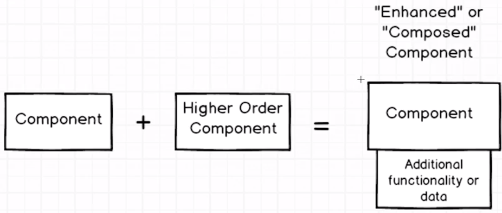
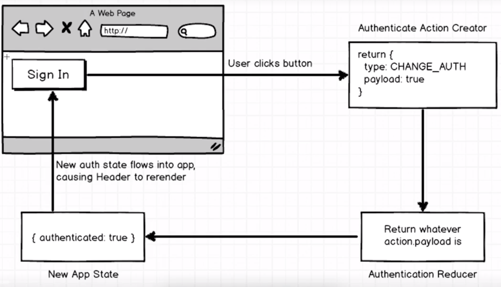

## Example of Authentication Higher Order Component Pattern
This project example demonstrate a pattern to create authentication HOC. Altough this pattern can be used to create any HOC.

Pattern for Auth Hoc [here](https://github.com/heron2014/hoc/blob/master/src/components/require_authentication.js)

## What are  Higher Order Components (hoc)

They are components that adds additional functionality to existing component that you've already written



#### Auth process
Basic auth process for this example (only client side)



### How to run this example
- clone this repo
- ```npm install```
- ```npm run start```
- navigate to ```localhost:8080```
